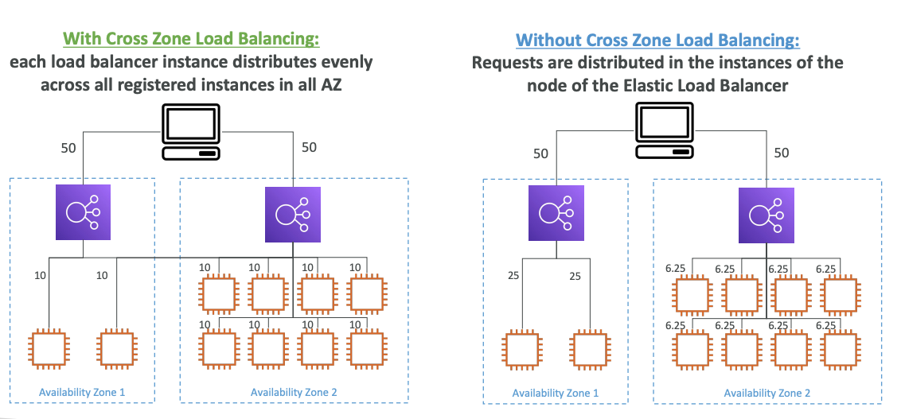
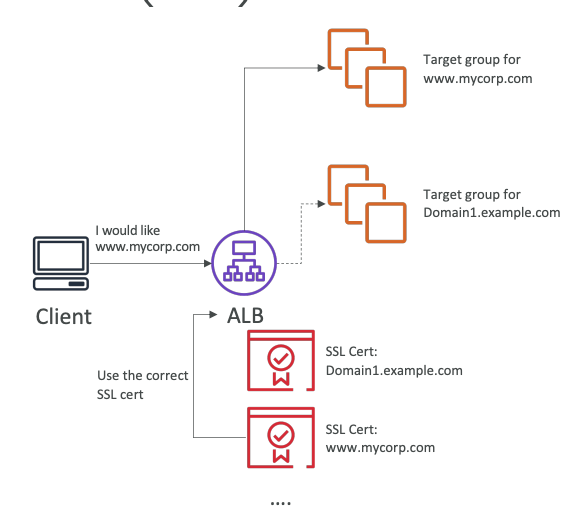
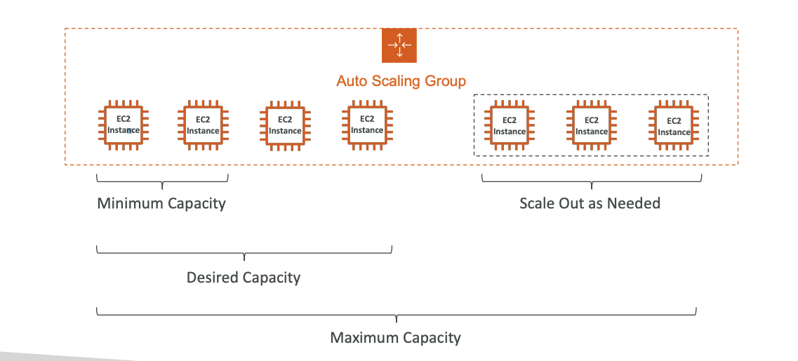

## ELASTIC LOAD BALANCER
1. Why use a load balancer? 
- Spread load across multiple downstream instances 
- Expose a single point of access (DNS) to your application 
- Seamlessly handle failures of downstream instances 
- Do regular health checks to your instances 
- Provide SSL termination (HTTPS) for your websites 
- Enforce stickiness with cookies 
- High availability across zones 
- Separate public traffic from private traffic

2. Why use an Elastic Load Balancer?
- An Elastic Load Balancer is a managed load balancer
- AWS guarantees that it will be working
- AWS takes care of upgrades, maintenance, high availability
- AWS provides only a few configuration knobs
- It costs less to setup your own load balancer but it will be a lot more effort on your end
- It is integrated with many AWS offerings / services
- EC2, EC2 Auto Scaling Groups, Amazon ECS
- AWS Certificate Manager (ACM), CloudWatch
- Route 53, AWS WAF, AWS Global Accelerator

3. Health Checks
- Health Checks are crucial for Load Balancers
- They enable the load balancer to know if instances it forwards traffic to are available to reply to requests
- The health check is done on a port and a route (/health is common)
- If the response is not 200 (OK), then the instance is unhealthy

4. **Types of load balancer on AWS**
- AWS has 4 kinds of managed Load Balancers
- **Classic Load Balancer (v1 - old generation) – 2009 – CLB**
    - HTTP, HTTPS, TCP, SSL (secure TCP)
    - Supports TCP (Layer 4), HTTP & HTTPS (Layer 7)
    - Health checks are TCP or HTTP based
    - Fixed hostname XXX.region.elb.amazonaws.com
- **Application Load Balancer (v2 - new generation) – 2016 – ALB**
    - HTTP, HTTPS, WebSocket
    - Load balancing to multiple HTTP applications across machines (target groups)
    - Load balancing to multiple applications on the same machine (ex: containers)
    - Support for HTTP/2 and WebSocket
    - Support redirects (from HTTP to HTTPS for example)
    - Routing tables to different target groups:
        - Routing based on path in URL (example.com/users & example.com/posts)
        - Routing based on hostname in URL (one.example.com & other.example.com)
        - Routing based on Query String, Headers (example.com/users?id=123&order=false)
    - ALB are a great fit for micro services & container-based application (example: Docker & Amazon ECS)
    - Has a port mapping feature to redirect to a dynamic port in ECS
    - In comparison, we’d need multiple Classic Load Balancer per application
    - Target Groups
        - EC2 instances (can be managed by an Auto Scaling Group) – HTTP
        - ECS tasks (managed by ECS itself) – HTTP
        - Lambda functions – HTTP request is translated into a JSON event
        - IP Addresses – must be private IPs
        - ALB can route to multiple target groups
        - Health checks are at the target group leve
- **Network Load Balancer (v2 - new generation) – 2017 – NLB**
    - TCP, TLS (secure TCP), UDP
    - Network load balancers (Layer 4) allow to:
        - Forward TCP & UDP traffic to your instances
        - Handle millions of request per seconds
        - Less latency ~100 ms (vs 400 ms for ALB)
    - NLB has one static IP per AZ, and supports assigning Elastic IP (helpful for whitelisting specific IP)
    - NLB are used for extreme performance, TCP or UDP traffic
    - Not included in the AWS free tier
    - Network Load Balancer –Target Groups
        - EC2 instances
        - IP Addresses – must be private IPs
        - Application Load Balancer (thanks to NLB you get fixed Ips and thanks tou ALB you get all rules and features)
        - Health Checks support the TCP, HTTP and HTTPS Protocols
- **Gateway Load Balancer – 2020 – GWLB**
    - Operates at layer 3 (Network layer) – IP Protocol
    - https://synechron.udemy.com/course/aws-certified-solutions-architect-associate-saa-c03/learn/lecture/28874688#overview
    - Deploy, scale, and manage a fleet of 3rd party network virtual appliances in AWS
    - Example: Firewalls, Intrusion Detection and Prevention Systems, Deep Packet Inspection Systems, payload manipulation, …
    - Operates at Layer 3 (Network Layer) – IP Packets
    - Combines the following functions:
    - Transparent Network Gateway – single entry/exit for all traffic
    - Load Balancer – distributes traffic to your virtual appliances
    - Uses the GENEVE protocol on port 6081
    - Gateway Load Balancer –Target Groups
        - EC2 instances
        - IP Addresses – must be private IPs
- Overall, it is recommended to use the newer generation load balancers as they provide more features
- Some load balancers can be setup as internal (private) or external (public) ELBs

5. **Sticky Sessions (Session Affinity)**
- It is possible to implement stickiness so that the same client is always redirected to the same instance behind a load balancer
- This works for Classic Load Balancer, Application Load Balancer, and Network Load Balancer
- For both CLB & ALB, the “cookie” used for stickiness has an expiration date you control
- Use case: make sure the user doesn’t lose his session data
- Enabling stickiness may bring imbalance to the load over the backend EC2 instances

6. Sticky Sessions – Cookie Names
_This is configured inside target group(attributes)_
- Application-based Cookies
    - Custom cookie
        - Generated by the target
        - Can include any custom attributes required by the application
        - Cookie name must be specified individually for each target group
        - Don’t use AWSALB, AWSALBAPP, or AWSALBTG (reserved for use by the ELB)
    - Application cookie
        - Generated by the load balancer
        - Cookie name is AWSALBAPP
    - Duration-based Cookies
        - Cookie generated by the load balancer
        - Cookie name is AWSALB for ALB, AWSELB for CLB

7. Cross-Zone Load Balancing
    - With Cross Zone Load Balancing: each load balancer instance distributes evenly across all registered instances in all AZ
    - Without Cross Zone Load Balancing: Requests are distributed in the instances of the node of the Elastic Load Balancer
    

    _It is configured on the ELB itself, attributes section_

    - Application Load Balancer  
        - Enabled by default (can be disabled at the Target Group level)  
        - No charges for inter AZ data  
    - Network Load Balancer & Gateway Load Balancer  
        - Disabled by default  
        - You pay charges ($) for inter AZ data if enabled  
    - Classic Load Balancer  
        - Disabled by default  
        - No charges for inter AZ data if enabled  

8. Load Balancer - SSL Certificates

- The load balancer uses an X.509 certificate (SSL/TLS server certificate)
- You can manage certificates using ACM (AWS Certificate Manager)
- You can create upload your own certificates alternatively
- HTTPS listener:
    - You must specify a default certificate
    - You can add an optional list of certs to support multiple domains
    - Clients can use SNI (Server Name Indication) to specify the hostname they reach
    - Ability to specify a security policy to support older versions of SSL / TLS (legacy clients)

9. SSL – Server Name Indication (SNI)
- 
- SNI solves the problem of loading multiple SSL certificates onto one web server (to serve multiple websites)
- It’s a “newer” protocol, and requires the client to indicate the hostname of the target server in the initial SSL handshake
- The server will then find the correct certificate, or return the default one

**Note:**
- Only works for ALB & NLB (newer generation), CloudFront
- Does not work for CLB (older gen)

10. Elastic Load Balancers – SSL Certificates

- Classic Load Balancer (v1)
    - Support only one SSL certificate
    - Must use multiple CLB for multiple hostname with multiple SSL certificates
- Application Load Balancer (v2)
    - Supports multiple listeners with multiple SSL certificates
    - Uses Server Name Indication (SNI) to make it work
- Network Load Balancer (v2)
    - Supports multiple listeners with multiple SSL certificates
    - Uses Server Name Indication (SNI) to make it work

11. **Connection Draining**
- Feature naming
    - Connection Draining – for CLB
    - Deregistration Delay – for ALB & NLB
- Time to complete “in-flight requests” while the instance is de-registering or unhealthy
- Stops sending new requests to the EC2 instance which is de-registering
- Between 1 to 3600 seconds (default: 300 seconds)
- Can be disabled (set value to 0)
- Set to a low value if your requests are short

## AUTO SCALING GROUP

1. What’s an Auto Scaling Group?
- In real-life, the load on your websites and application can change
- In the cloud, you can create and get rid of servers very quickly

- The goal of an Auto Scaling Group (ASG) is to:
    - Scale out (add EC2 instances) to match an increased load
    - Scale in (remove EC2 instances) to match a decreased load
    - Ensure we have a minimum and a maximum number of EC2 instances running
    - Automatically register new instances to a load balancer
    - Re-create an EC2 instance in case a previous one is terminated (ex: if unhealthy)
- ASG are free (you only pay for the underlying EC2 instances)

2. Auto Scaling Group Attributes
- A Launch Template (older “Launch Configurations” are deprecated)
    - AMI + Instance Type
    - EC2 User Data
    - EBS Volumes
    - Security Groups
    - SSH Key Pair
    - IAM Roles for your EC2 Instances
    - Network + Subnets Information
    - Load Balancer Information
    - Min Size / Max Size / Initial Capacity
- Scaling Policies

3. Auto Scaling - CloudWatch Alarms & Scaling
- It is possible to scale an ASG based on CloudWatch alarms
- An alarm monitors a metric (such as Average CPU, or a custom metric)
- Metrics such as Average CPU are computed for the overall ASG instances
- Based on the alarm:
    - We can create scale-out policies (increase the number of instances)
    - We can create scale-in policies (decrease the number of instances)

4. Auto Scaling Groups – Scaling Policies
- Dynamic Scaling
    - Target Tracking Scaling   
        - Simple to set-up
        - Example: I want the average ASG CPU to stay at around 40%
    - Simple / Step Scaling
        - When a CloudWatch alarm is triggered (example CPU > 70%), then add 2 units
        - When a CloudWatch alarm is triggered (example CPU < 30%), then remove 1
    - Scheduled Scaling
        - Anticipate a scaling based on known usage patterns
        - Example: increase the min capacity to 10 at 5 pm on Fridays
    - Predictive scaling: continuously forecast load and schedule scaling ahead

5. Good metrics to scale on
- CPUUtilization: Average CPU utilization across your instances
- RequestCountPerTarget: to make sure the number of requests per EC2 instances is stable
- Average Network In / Out (if you’re application is network bound)
- Any custom metric (that you push using CloudWatch)

6. Auto Scaling Groups - Scaling Cooldowns
- After a scaling activity happens, you are in the cooldown period (default 300 seconds)
- During the cooldown period, the ASG will not launch or terminate additional instances (to allow for metrics to stabilize)
- Advice: Use a ready-to-use AMI to reduce configuration time in order to be serving request fasters and reduce the cooldown period