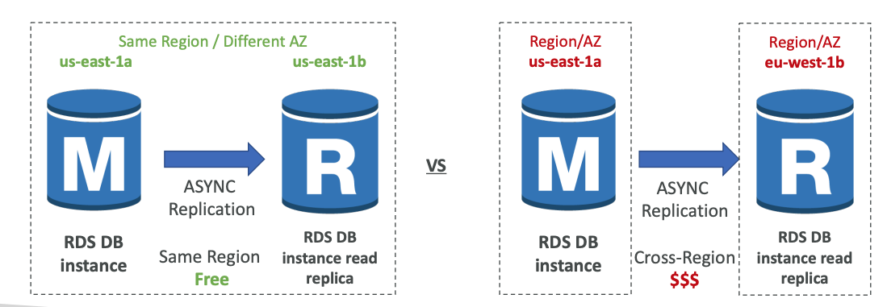

1. Amazon RDS Overview 
- Tool for connecting to DB sqlectron -> https://github.com/sqlectron/sqlectron-gui/releases/tag/v1.38 .0
- RDS stands for Relational Database Service
- It’s a managed DB service for DB use SQL as a query language.
- It allows you to create databases in the cloud that are managed by AWS
    - Postgres
    - MySQL
    - MariaDB
    - Oracle
    - Microsoft SQL Server
    - Aurora (AWS Proprietary database)

2. Advantage over using RDS versus deploying DB on EC2
- RDS is a managed service:
    - Automated provisioning, OS patching
    - Continuous backups and restore to specific timestamp (Point in Time Restore)!
    - Monitoring dashboards
    - Read replicas for improved read performance
    - Multi AZ setup for DR (Disaster Recovery)
    - Maintenance windows for upgrades
    - Scaling capability (vertical and horizontal)
    - Storage backed by EBS (gp2 or io1)
- BUT you can’t SSH into your instances

3. RDS – Storage Auto Scaling
- Helps you increase storage on your RDS DB instance dynamically
- When RDS detects you are running out of free database storage, it scales automatically
- Avoid manually scaling your database storage 
- You have to set Maximum Storage Threshold (maximum limit for DB storage) 
- Automatically modify storage if:
    - Free storage is less than 10% of allocated storage 
    - Low-storage lasts at least 5 minutes 
    - 6 hours have passed since last modification 
- Useful for applications with unpredictable workloads 
- Supports all RDS database engines (MariaDB, MySQL, PostgreSQL, SQL Server, Oracle)

4. RDS Read Replicas for read scalability
- Up to 15 Read Replicas
- Within AZ, Cross AZ or Cross Region
- Replication is ASYNC, so reads are eventually consistent
- Replicas can be promoted to their own DB
- Applications must update the connection string to leverage read replicas

5. RDS Read Replicas – Use Cases
- You have a production database that is taking on normal load
- You want to run a reporting application to run some analytics
- You create a Read Replica to run the new workload there
- The production application is unaffected
- Read replicas are used for SELECT (=read) only kind of statements (not INSERT, UPDATE, DELETE)

5. **RDS Read Replicas – Network Cost** 
- In AWS there’s a network cost when data goes from one AZ to another
- For RDS Read Replicas within the same region, you don’t pay that fee

6. **RDS Multi AZ (Disaster Recovery)**
- SYNC replication
- One DNS name – automatic app failover to standby
- Increase availability
- Failover in case of loss of AZ, loss of network, instance or storage failure
- No manual intervention in apps
- Not used for scaling
- Note:The Read Replicas be setup as Multi AZ for Disaster Recovery (DR)

7. **RDS – From Single-AZ to Multi-AZ**

- Zero downtime operation (no need to stop the DB)
- Just click on “modify” for the database
- The following happens internally:
    - A snapshot is taken
    - A new DB is restored from the snapshot in a new AZ
    - Synchronization is established between the two databases

8. **RDS Custom**
- **Managed Oracle and Microsoft SQL Server Database with OS and database customization**
- RDS: Automates setup, operation, and scaling of database in AWS
- Custom: access to the underlying database and OS so you can
    - Configure settings
    - Install patches
    - Enable native features
    - Access the underlying EC2 Instance using SSH or SSM Session Manager
- De-activate Automation Mode to perform your customization, better to take a DB snapshot before
- RDS vs. RDS Custom
    - RDS: entire database and the OS to be managed by AWS
    - RDS Custom: full admin access to the underlying OS and the database

9. **Amazon Aurora**
- Aurora is a proprietary technology from AWS (not open sourced)
- Postgres and MySQL are both supported as Aurora DB (that means your drivers will work as if Aurora was a Postgres or MySQL database)
- Aurora is “AWS cloud optimized” and claims 5x performance improvement over MySQL on RDS, over 3x the performance of Postgres on RDS
- Aurora storage automatically grows in increments of 10GB, up to 128 TB.
- Aurora can have up to 15 replicas and the replication process is faster than MySQL (sub 10 ms replica lag)
- Failover in Aurora is instantaneous. It’s HA (High Availability) native.
- Aurora costs more than RDS (20% more) – but is more efficient

10. Aurora High Availability and Read Scaling
- 6 copies of your data across 3 AZ:
    - 4 copies out of 6 needed for writes
    - 3 copies out of 6 need for reads
    - Self healing with peer-to-peer replication
    - Storage is striped across 100s of volumes
- One Aurora Instance takes writes (master)
- Automated failover for master in less than 30 seconds
- Master + up to 15 Aurora Read Replicas serve reads
- **Support for Cross Region Replication**

11. Aurora DB Cluster

12. Features of Aurora
- Automatic fail-over
- Backup and Recovery
- Isolation and security
- Industry compliance
- Push-button scaling
- Automated Patching with Zero Downtime
- Advanced Monitoring
- Routine Maintenance
- Backtrack: restore data at any point of time without using backups

13. Aurora Replicas - Auto Scaling

14. Aurora – Custom Endpoints
- Define a subset of Aurora Instances as a Custom Endpoint
- Example: Run analytical queries on specific replicas
- The Reader Endpoint is generally not used after defining Custom Endpoints

15. Aurora Serverless
- Automated database instantiation and auto - scaling based on actual usage
- Good for infrequent, intermittent or unpredictable workloads
- No capacity planning needed
- Pay per second, can be more cost-effective

16. Global Aurora
- Aurora Cross Region Read Replicas:
- Useful for disaster recovery
- Simple to put in place
- Aurora Global Database (recommended):
- 1 Primary Region (read / write)
- Up to 5 secondary (read-only) regions, replication lag is less than 1 second
- Up to 16 Read Replicas per secondary region
- Helps for decreasing latency
- Promoting another region (for disaster recovery) has an RTO of < 1 minute
- **Typical cross-region replication takes less than 1 second**

17. Aurora Machine Learning
- Enables you to add ML-based predictions to your applications via SQL
- Simple, optimized, and secure integration between Aurora and AWS ML services
- Supported services
- Amazon SageMaker (use with any ML model)
- Amazon Comprehend (for sentiment analysis)
- You don’t need to have ML experience
- Use cases: fraud detection, ads targeting, sentiment analysis, product recommendations

18. RDS Backups
Automated backups:
    - Daily full backup of the database (during the backup window)
    - Transaction logs are backed-up by RDS every 5 minutes
    - => ability to restore to any point in time (from oldest backup to 5 minutes ago)
    - 1 to 35 days of retention, set 0 to disable automated backups
- Manual DB Snapshots
    - Manually triggered by the user
    - Retention of backup for as long as you want

- Trick: in a stopped RDS database, you will still pay for storage. If you plan on stopping it for a long time, you should snapshot & restore instead

19. Aurora Backups
- **Automated backups** 
    - 1 to 35 days (cannot be disabled) 
    - point-in-time recovery in that timeframe 
- **Manual DB Snapshots**
    - Manually triggered by the user 
    - Retention of backup for as long as you want

20. RDS & Aurora Restore options
- Restoring a RDS / Aurora backup or a snapshot creates a new database
- Restoring MySQL RDS database from S3
    - Create a backup of your on-premises database
    - Store it on Amazon S3 (object storage)
    - Restore the backup file onto a new RDS instance running MySQL
- Restoring MySQL Aurora cluster from S3
    - Create a backup of your on-premises database using Percona XtraBackup
    - Store the backup file on Amazon S3
    - Restore the backup file onto a new Aurora cluster running MySQL

21. Aurora Database Cloning
- Create a new Aurora DB Cluster from an existing one
- Faster than snapshot & restore
- Uses copy-on-write protocol
    - Initially, the new DB cluster uses the same data volume as the original DB cluster (fast and efficient – no copying is needed)
    - When updates are made to the new DB clusterdata, then additional storage is allocated and data is copied to be separated
- Very fast & cost-effective
- **Useful to create a “staging” database from a “production” database without impacting the production database**